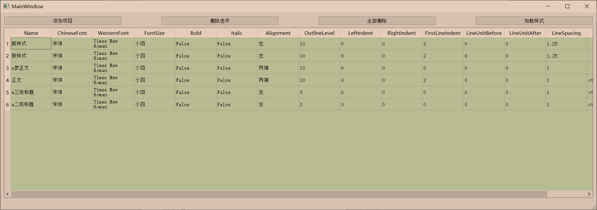

# Load Styles from csv to Office Word

加载自定义样式集到当前活动的 word 文档。

Using styles in office word can improve the efficiency of typesetting. We often customize our styles for special usages. But this settings are tedious and inefficient. 

Hence, I write a python program, which can load the styles defined in csv file to the active word document. Besides, we can also browse, edit, add, and delete these styles.

style.csv format:

| Name      | ChineseFont | WesternFont     | FontSize | Bold  | Italic | Alignment | OutlineLevel | LeftIndent | RightIndent | FirstLineIndent | LineUnitBefore | LineUnitAfter | LineSpacing | Shortcut |
| --------- | ----------- | --------------- | -------- | ----- | ------ | --------- | ------------ | ---------- | ----------- | --------------- | -------------- | ------------- | ----------- | -------- |
| 新样式    | 宋体        | Times New Roman | 小四     | FALSE | FALSE  | 左        | 10           | 0          | 0           | 2               | 0              | 0             | 1.25        |          |
| a参正文   | 宋体        | Times New Roman | 小四     | FALSE | FALSE  | 两端      | 10           | 0          | 0           | 0               | 0              | 0             | 1           |          |
| 正文      | 宋体        | Times New Roman | 小四     | FALSE | FALSE  | 两端      | 10           | 0          | 0           | 2               | 0              | 0             | 1           | ctrl+`   |
| a三级标题 | 宋体        | Times New Roman | 小四     | FALSE | FALSE  | 左        | 3            | 0          | 0           | 0               | 0              | 0             | 1           | ctrl+3   |
| a二级标题 | 宋体        | Times New Roman | 小四     | FALSE | FALSE  | 左        | 2            | 0          | 0           | 0               | 0              | 0             | 1           | ctrl+2   |

main window:

